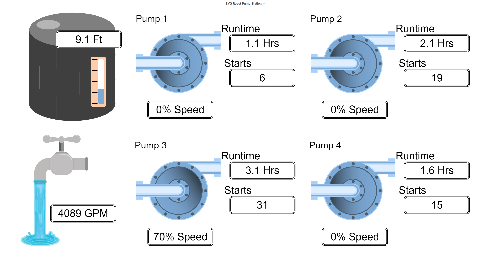

# Grafana React SVG Panel Plugin

<!-- 
[](https://circleci.com/gh/grafana/simple-react-panel)
[](https://david-dm.org/grafana/simple-react-panel)
[](https://david-dm.org/grafana/simple-react-panel/?type=dev)
[](https://snyk.io/test/github/grafana/simple-react-panel)
[](https://codeclimate.com/github/grafana/simple-react-panel/maintainability)
[](https://codeclimate.com/github/grafana/simple-react-panel/test_coverage) -->



This is an SVG panel plugin for Grafana 7.x+

## Why yet another SVG panel plugin?
Yes, I definitely considered naming it YASPP...
The existing SVG panel plugins all use the pre-7.0, angular panel API. I wanted to be able to use all of the features included in the new data API, as well as potential performance improvements from migrating to React.
I have also taken a slightly different direction/philosophy from some of the other SVG plugins.

## How does it work?
- Users of this plugin are expected to have ready to animate SVG graphics created in an vector design package (See inkscape, Adobe Illustrator, or a web tool like draw.io).
- Users upload their existing SVG layouts into the plugin, then enable the "Click to Map" functionality, allowing you to easily map arbitrary group, path or text span IDs to named tokens.
- Users then perform additional setup tasks in an init function that gets called each time the SVG panel is loaded.
- Finally, users can access the elements of the SVG using the named tokens from within the render function, called whenever the panel receieves new data.
- User code in either the render or init functions have access to all of the mapped elements, the root SVG document, a ephemeral state store and the DataFrames for the panel.

## What are the goals for this project?
1. Be the most performant way to visualize arbitrary SVG graphics and animations within Grafana
2. Stay out of the way - This plugin will focus on providing simple, obvious tools to reduce the friction of converting your static SVG graphics into data driven visualizations, without limiting your options.
3. Stay focused - This plugin will not attempt to be an online graphics editor.


## Getting started
1. Install dependencies
```BASH
yarn install
```
2. Build plugin in development mode or run in watch mode
```BASH
yarn dev
```
or
```BASH
yarn watch
```
3. Build plugin in production mode
```BASH
yarn build
```

## Learn more
- [SVG.js](https://svgjs.com) The Core SVG library made available for SVG DOM manipulations.
- [Monaco Editor](https://microsoft.github.io/monaco-editor/) The editor used for user code.
- [Grafana documentation](https://grafana.com/docs/)
